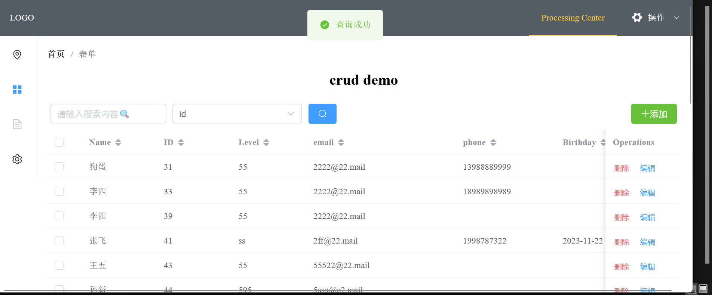
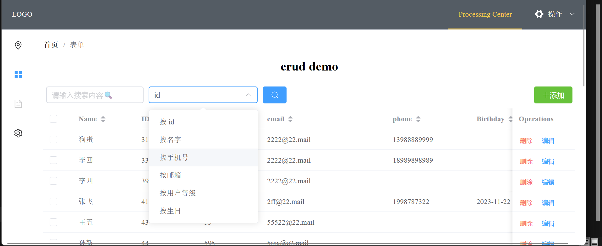
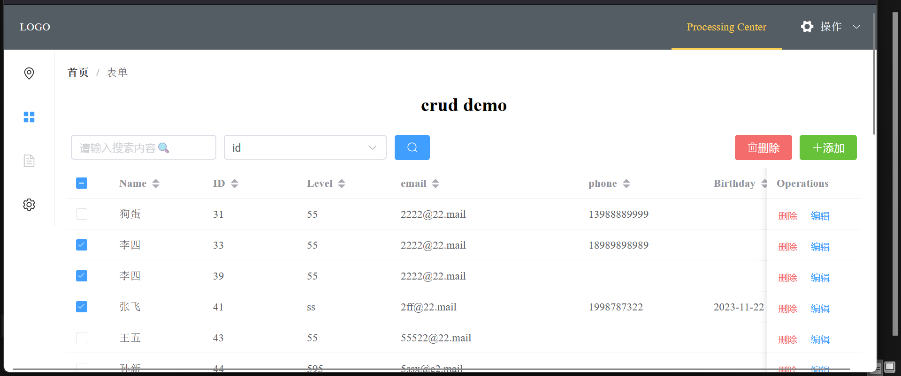
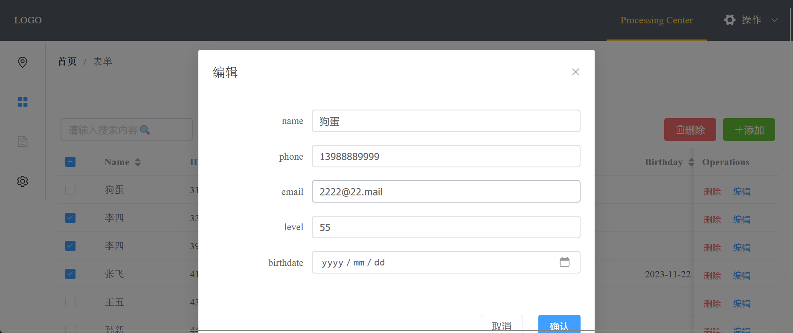
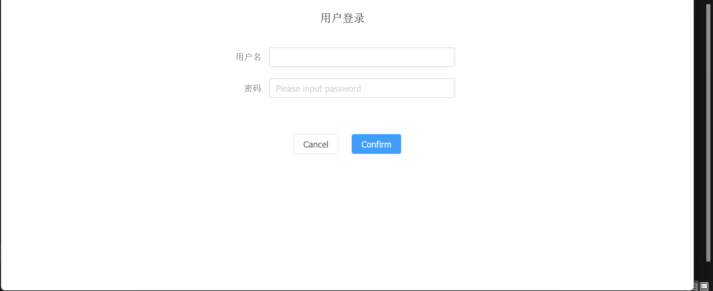
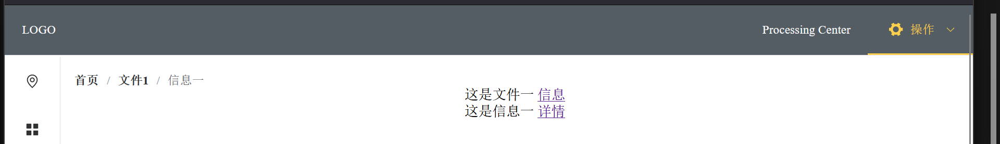
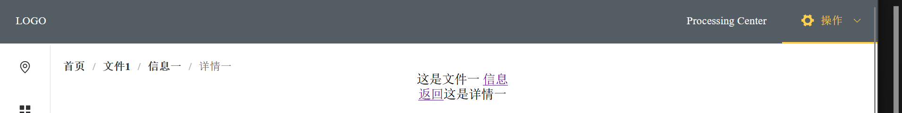

# go-crud-template

✨基于 Go, gorm, gin 和 MySQL 和 vue3, axios 的简单信息管理系统模板✨📌含完整前后端：信息管理系统模板，后台管理系统模板，数据库管理系统模板。实现对数据库最基本的增删改查（CRUD）。📌前后端分离

📌[配套前端项目地址](https://github.com/bytesc/vue-crud-template)

[个人网站：www.bytesc.top](http://www.bytesc.top) 

[个人博客：blog.bytesc.top](http://blog.bytesc.top)

🔔 如有项目相关问题，欢迎在本项目提出`issue`，我一般会在 24 小时内回复。

## 效果展示



完善的查询



多选删除



编辑行



全局遮罩的登录界面



面包屑导航




## 项目运行方法

### 后端运行环境

- `go1.20.5`
- `MySQL 8.0.31`

### 安装依赖
```bash
# go get -u gorm.io/driver/sqlite
go get -u gorm.io/driver/mysql
go get -u gorm.io/gorm
go get -u github.com/gin-gonic/gin

go get -u github.com/golang-jwt/jwt/v5

go get -u go.uber.org/zap
```

### 创建数据库

登录`mysql`终端，创建数据库：
```sql
create database  数据库名 default charset utf8mb4;
```

导入示例数据表
```bash
mysql -u数据库用户名 -p数据库密码 -D数据库名 < ./mysql_backup/crud-list.sql
```

### 连接数据库
`./mysql_db/connect_db.go` 第15行附近，修改dsn字符串。

`数据库用户名`:`数据库密码`@tcp(`数据库ip或域名`:`数据库端口`)/`数据库名`?charset=utf8mb4&parseTime=True&loc=Local

```go
func ConnectToDatabase() (*gorm.DB, error) {
	//链接数据库
	// 参考 https://github.com/go-sql-driver/mysql#dsn-data-source-name 获取详情
	dsn := "root:123456@tcp(127.0.0.1:3306)/crud-list?charset=utf8mb4&parseTime=True&loc=Local"
    //...............
}
```

如果需要使用其它数据库，例如 `PostgreSQL, SQLite, SQL Server`。参考 [grom 官方文档 数据库连接](https://gorm.io/zh_CN/docs/connecting_to_the_database.html)

### 运行

编译：
```bash
go build # 整个文件夹
# go build main.go # 单个文件
```

运行：
```bash
.\go_crud.exe
```

浏览器输入 url:
```txt
http://localhost:8088/ping
```
看到以下内容代表服务运行成功
```js
{"message":"请求成功"}
```
如果希望看到界面，需要用到配套的前端项目📌[配套前端项目地址](https://github.com/bytesc/vue-crud-template)

### 运行端口

`./main.go` 第34行附近。如果端口号被占用，可以修改此处。
```go
	r.Run("0.0.0.0:8088") // 监听并在 0.0.0.0:8088 上启动服务
	// http://127.0.0.1:8088/ping
```

### gin gorm 官方文档
- https://gorm.io/zh_CN/docs
- https://gin-gonic.com/zh-cn/docs


## 接口文档

[接口文档 `docs/api.md`](./docs/api.md)


# 开源许可证

此翻译版本仅供参考，以 LICENSE 文件中的英文版本为准

MIT 开源许可证：

版权所有 (c) 2023 bytesc

特此授权，免费向任何获得本软件及相关文档文件（以下简称“软件”）副本的人提供使用、复制、修改、合并、出版、发行、再许可和/或销售软件的权利，但须遵守以下条件：

上述版权声明和本许可声明应包含在所有副本或实质性部分中。

本软件按“原样”提供，不作任何明示或暗示的保证，包括但不限于适销性、特定用途适用性和非侵权性。在任何情况下，作者或版权持有人均不对因使用本软件而产生的任何索赔、损害或其他责任负责，无论是在合同、侵权或其他方面。