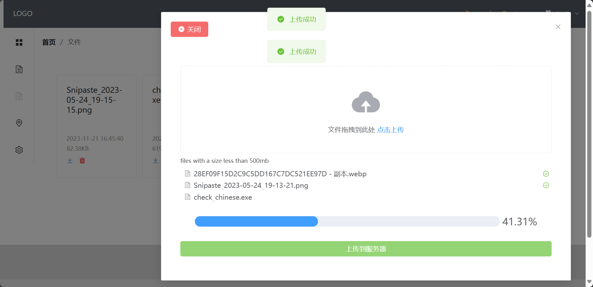
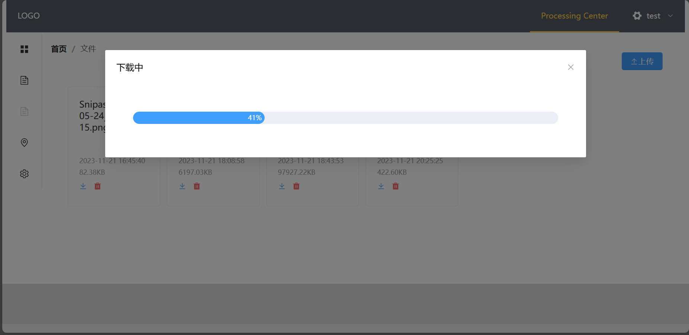
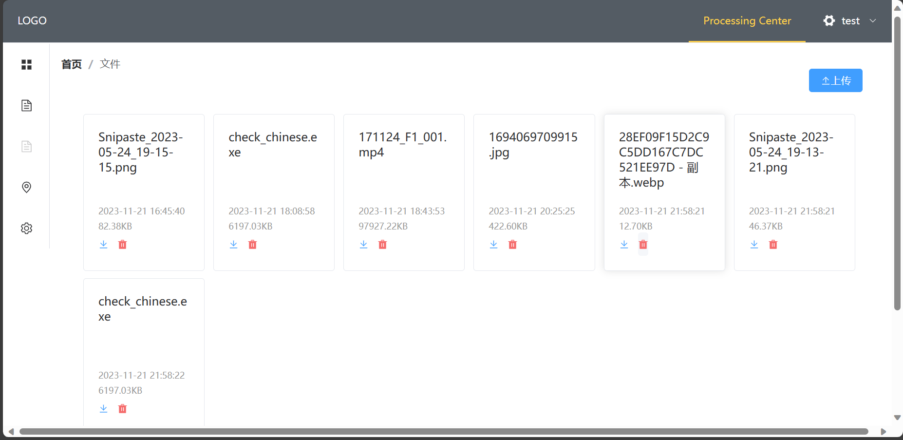
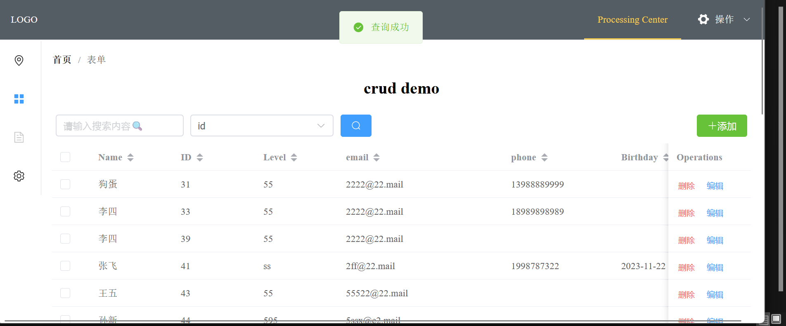
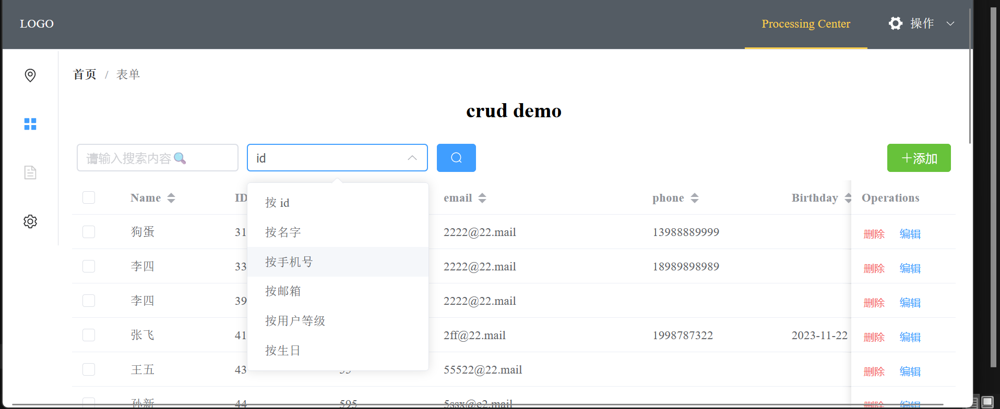
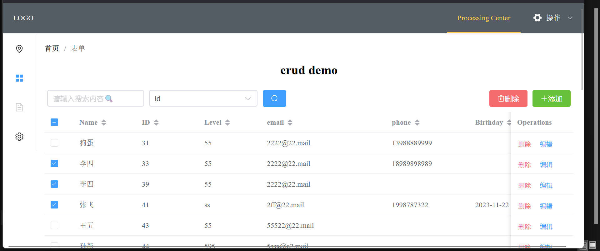
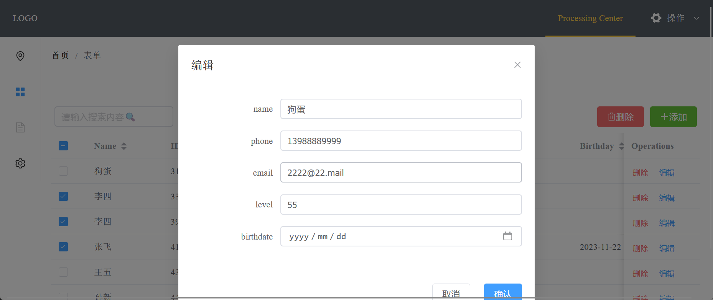
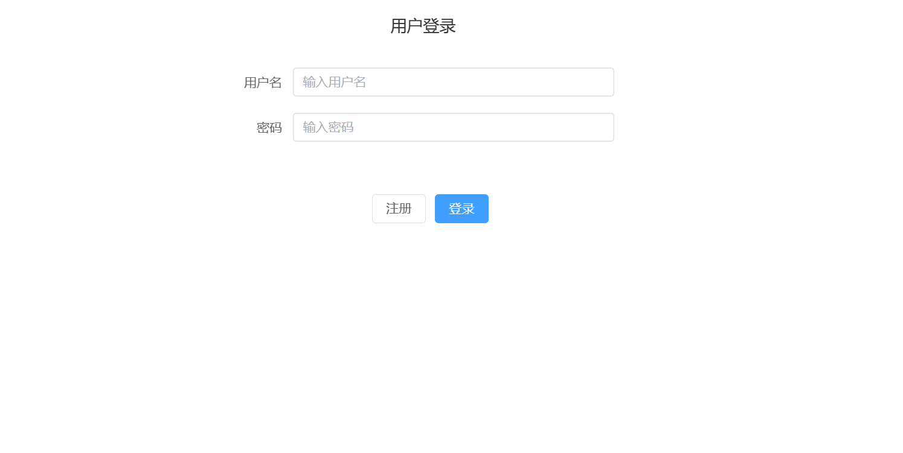
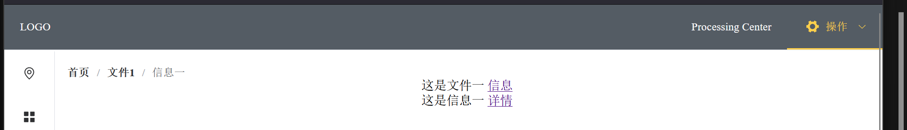
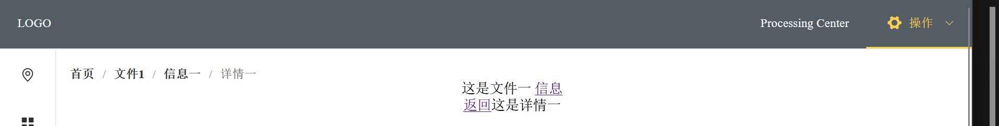

# go-crud-template

✨基于 Go, gorm, gin 和 MySQL 和 vue3, axios 的简单信息管理系统模板✨📌含完整前后端，项目在线demo：信息管理系统模板，后台管理系统模板，数据库管理系统模板。实现令牌签验，非对称加密，通过 Web 应用完成对数据库的增删改查(CRUD)，文件流的上传和下载。📌前后端分离

📌[在线演示链接](http://bytesc.top:8009)

📌[配套前端项目地址](https://github.com/bytesc/vue-crud-template)

[个人网站：www.bytesc.top](http://www.bytesc.top) 

🔔 如有项目相关问题，欢迎在本项目提出`issue`，我一般会在 24 小时内回复。

## 效果展示

### 文件流

文件流上传



文件流下载



文件列表



### CRUD



完善的查询



多选删除



编辑行




### 用户登录



面包屑导航




## 项目运行方法

### 后端运行环境

- `go1.20.5`
- `MySQL 8.0.31`

### 安装依赖
（非必要，后续运行时候也会自动安装）
```bash
# go mod download
# go get -u gorm.io/driver/sqlite
go get -u gorm.io/driver/mysql
go get -u gorm.io/gorm
go get -u github.com/gin-gonic/gin

go get -u github.com/golang-jwt/jwt/v5

go get -u go.uber.org/zap

go get github.com/go-playground/validator/v10

go get github.com/spf13/viper
go get github.com/gin-gonic/gin/binding@v1.9.1

go get -u github.com/gin-contrib/cors
```

### 创建数据库

登录`mysql`终端，创建数据库：
```sql
create database  数据库名 default charset utf8mb4;
```

### 连接数据库

`./conf/config.yaml` 为项目配置文件

修改其中
```yaml
db:
  DriverName: mysql
  Database: crud-list
  Port: 3306
  UserName: root
  Password: 123456
  Host: 127.0.0.1
  Charset: utf8mb4
```

如果需要使用其它数据库，例如 `PostgreSQL, SQLite, SQL Server`。`./mysql_db/connect_db.go` 为数据库配置文件。修改方法，参考 [grom 官方文档 数据库连接](https://gorm.io/zh_CN/docs/connecting_to_the_database.html)

### 配置端口

`./conf/config.yaml` 
```yaml
server:
  Addr: 0.0.0.0
  Port: 8008
```
这里 `0.0.0.0` 代表运行来自所有 ip 的访问

### 运行

编译（会自动安装依赖）：
```bash
go env -w GO111MODULE=on
go env -w GOPROXY=https://goproxy.cn,direct
go build # 整个文件夹
# go build main.go # 单个文件
```

运行：
```bash
.\go_crud
```

浏览器输入 url:
```txt
http://localhost:8008/ping
```
看到以下内容代表服务运行成功
```js
{"message":"请求成功"}
```
如果希望看到界面，需要用到配套的前端项目📌[配套前端项目地址](https://github.com/bytesc/vue-crud-template)


### gin gorm 官方文档
- https://gorm.io/zh_CN/docs
- https://gin-gonic.com/zh-cn/docs


# 开源许可证

此翻译版本仅供参考，以 LICENSE 文件中的英文版本为准

MIT 开源许可证：

版权所有 (c) 2023 bytesc

特此授权，免费向任何获得本软件及相关文档文件（以下简称“软件”）副本的人提供使用、复制、修改、合并、出版、发行、再许可和/或销售软件的权利，但须遵守以下条件：

上述版权声明和本许可声明应包含在所有副本或实质性部分中。

本软件按“原样”提供，不作任何明示或暗示的保证，包括但不限于适销性、特定用途适用性和非侵权性。在任何情况下，作者或版权持有人均不对因使用本软件而产生的任何索赔、损害或其他责任负责，无论是在合同、侵权或其他方面。
